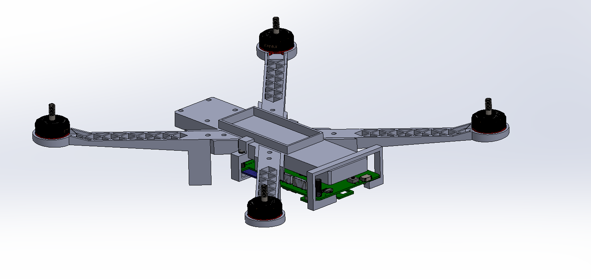
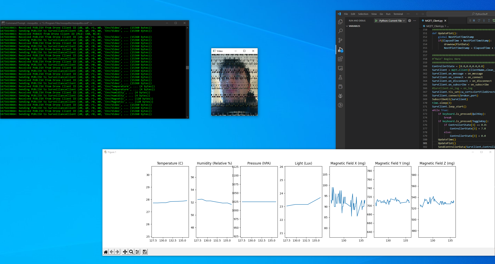
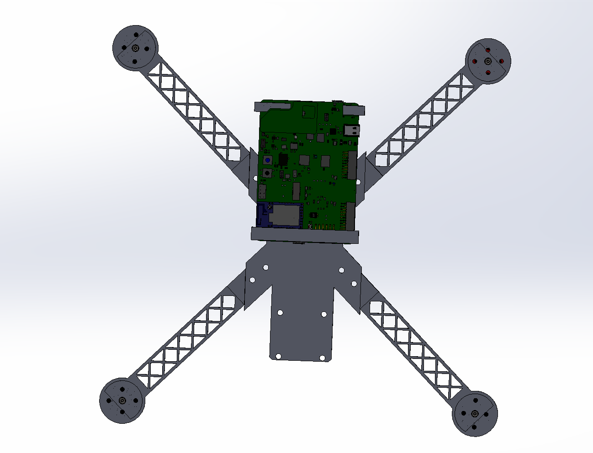
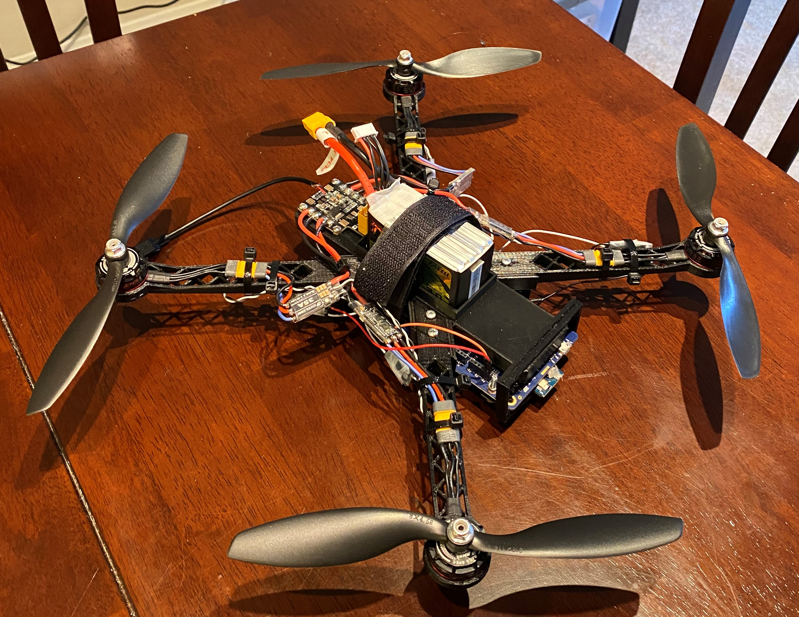

# DroneMQTT

This project is an MQTT Based Surveillance Drone/Quad Copter. It uses the B-U585I-IOT02A STM32 Discovery board which comes equipped with several sensors and a 30 pin ZIF connector used to interface with a camera (OV5640). The camera is part of a COTs module B-CAMS-OMV, which is also from ST Micro. It comes with an EMW3080B chip programmed using ST's X-WIFI-EMW3080B firmware package. The EMW3080 forms the 802.11 network interface.

The user interface presents itself on a desktop computer running the MQTT Broker in the background (Though it could be any desktop computer on your LAN that has the self-signed security certificate). The drone publishes camera and sensor data to the MQTT Broker, and a python script will plot the most recent 10s of sensor data using matplotlib. The camera data is published in the same way, but transmitted in 10 16KB chunks and it is displayed using OpenCV. I am currently investigating a bug related to the camera image quality, which is currently very bad. 

The firmware stack includes ThreadX for the RTOS, NetXDuo for the TCP/IP Stack, and the STM32 HAL for interfacing with MCU Peripherals. All MEMS sensors are interfaced with via I2C, the Camera uses DCMI, and the Network IC uses SPI. The camera data is moved to a ping pong frame buffer on an external SRAM chip in memory-mapped mode via DMA and OCTO-SPI. Due to to being in memory mapped mode, the d-cache must be invalidated every time a camera DMA transfer completes. Four timers are used as well: SysTick, TIM6, TIM3, and TIM7. SysTick is used as the RTOS Timebase, while TIM6 is used as a millisecond timebase (for "delay" functionality). TIM7 is used as an 52Hz IRQ. 52Hz is the same frequency as the accelerometer and gyro, and this ISR is used to wake up the Accel/Gyro/Kalman/PID Thread. TIM3 is used to generate the PWM signals used by the 4 motors. These are programmed to interface with 4 ESCs in "OneShot42" mode (a 42uS pulse = motor OFF, 126 pulse = motor full speed). 

PID and Kalman Filter tuning is still WIP, but works somewhat well now. The motors/ESCs have an area around 1-2% thrust where the motors don't turn at all, but an area around 2-3.5% where the motors turn quite fast (a very dramatic increase in speed for a very small change in thrust). Meanwhile, the motors running at 6% or 8% thrust results in the motors running fast or slightly faster (a much less dramatic speed delta compared to 1% to 3%). I currently need to figure out a good minimum speed to run the motors at, that is slow enough to let the drone gently decrease in altitude, but fast enough that the PID control will not send any of the motors into the zone around 1-3% thrust where the motors experience a much more dramatic change in speed. In essence, the PID is unstable around 1-3% thrust and that area needs to be avoided.

[Testing Video](https://youtu.be/pFwCIVHbRDQ)
